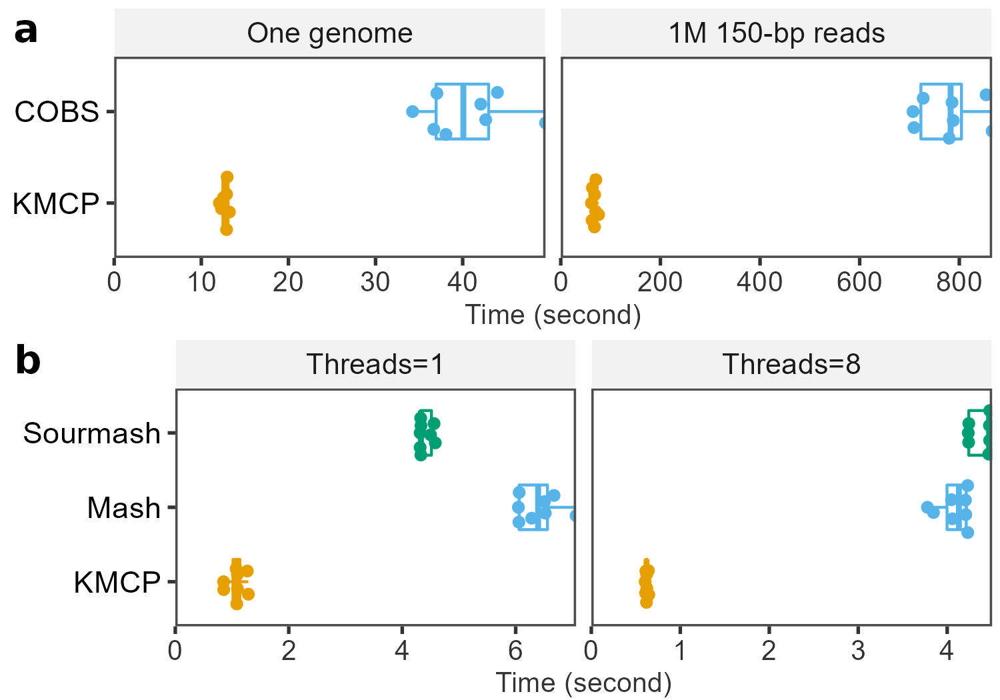

## Preparing data

KMCP vs COBS

    cat bench.kmcp-cobs.short.tsv \
        | csvtk cut -t -f 1,2,4 \
        | csvtk rename -t  -f 2,3 -n COBS,KMCP \
        | csvtk gather -t -k app -v time -f 2,3 \
        | csvtk mutate2 -t -n group -e '"short reads"' \
        | csvtk tab2csv \
        > bench.kmcp-cobs.short.tsv.time.csv

    cat bench.kmcp-cobs.long.tsv \
        | csvtk cut -t -f 1,2,4 \
        | csvtk rename -t  -f 2,3 -n COBS,KMCP \
        | csvtk gather -t -k app -v time -f 2,3 \
        | csvtk mutate2 -t -n group -e '"one genome"' \
        | csvtk tab2csv \
        > bench.kmcp-cobs.long.tsv.time.csv
        
    csvtk concat bench.kmcp-cobs.short.tsv.time.csv bench.kmcp-cobs.long.tsv.time.csv \
        > bench.kmcp-cobs.csv
        
KMCP vs Mash and Sourmash

    cat bench.kmcp-mash-sourmash.thread1.tsv \
        | csvtk cut -t -f 1,2,4,6 \
        | csvtk rename -t  -f 2,3,4 -n Mash,Sourmash,KMCP \
        | csvtk gather -t -k app -v time -f 2,3,4 \
        | csvtk mutate2 -t -n group -e '"threads=1"' \
        | csvtk tab2csv \
        > bench.kmcp-mash-sourmash.thread1.tsv.csv
        
    cat bench.kmcp-mash-sourmash.thread8.tsv \
        | csvtk cut -t -f 1,2,4,6 \
        | csvtk rename -t  -f 2,3,4 -n Mash,Sourmash,KMCP \
        | csvtk gather -t -k app -v time -f 2,3,4 \
        | csvtk mutate2 -t -n group -e '"threads=8"' \
        | csvtk tab2csv \
        > bench.kmcp-mash-sourmash.thread8.tsv.csv
        
    csvtk concat bench.kmcp-mash-sourmash.thread1.tsv.csv bench.kmcp-mash-sourmash.thread8.tsv.csv\
        > bench.kmcp-mash-sourmash.csv
    
## Plotting

    ./plot.R
    

    
